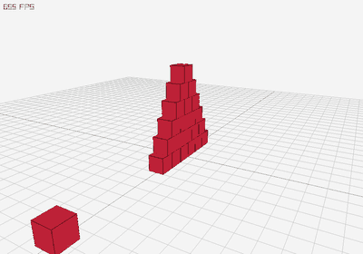

# 3D Rigid Body Physics Simulation
Pythonで作成した、3D剛体物理シミュレーションのプロトタイプです。  
描画には `pyray` / raylib を利用し、物理演算部分はできるだけ自分で実装しています。

## 概要

このプロジェクトでは、3D空間上の球・箱・平面を対象に、重力、剛体運動、衝突判定、衝突応答を行います。  
単に既存の物理エンジンを利用するのではなく、ベクトル・行列・四元数・慣性テンソル・接触解決などの仕組みを理解しながら実装することを目的として作成しました。

当初は、音楽制作者がキャラクターや3DCG表現を使った映像表現に挑戦する際の技術的ハードルを下げるため、3D表現を自分で扱える基盤を作れないかと考えて制作を始めました。完成版ではありませんが、3D描画と物理シミュレーションの基礎部分を実装しています。

## 主な機能

- 3Dベクトル、3x3行列、四元数の自作実装
- 球、箱、平面の剛体表現
- 重力による運動シミュレーション
- 剛体の並進・回転運動
- 球・箱・平面の衝突判定
- AABBによる大まかな衝突候補の抽出
- SAT（Separating Axis Theorem）による箱同士の衝突判定
- 接触点・接触法線・貫入深度を用いた接触情報の生成
- 反発係数と摩擦を考慮したインパルスベースの速度解決
- 簡易的な位置補正による貫入解消
- スリープ機構（静止した剛体を物理計算から除外し、接触で起こす）
- raylib / pyray による3D描画
- カメラ操作付きのデモシーン

## デモ

### ドミノ風シーン

箱を横に並べ、球を落として衝突させるシーンです。

```bash
python -m demos.domino_scene
```

### 箱のピラミッドに物体を撃ち込むシーン

箱を積み上げたピラミッドに、高速の箱を横から衝突させるシーンです。



```bash
python -m demos.cannon_pyramid_scene
```

### FPS風に歩ける遊び場シーン

球で表現したプレイヤーを用いて、一人称視点でフィールドを歩き回り、物理演算で遊べるデモです。フィールドには次の遊び場があります。

- **ドミノコース**（47枚）：S字カーブ → 上り階段 → 高台 → 下り階段 → 橋の下 → カーブ → 1枚ごとに巨大化するフィナーレ、と続く1本道のコース。足元のボールを投げて先頭を倒すと連鎖します。
- **ボウリングレーン**：ガター壁つきのレーンの先に10本のピン。重いボールを拾って投げ込みます。
- **バスケットゴール**：バックボードつきのリング。ボールが上からリングを通過するとスコアが加算されます。

画面上部に倒れたドミノ・ピン・バスケのスコアが表示されます。

```bash
python -m demos.fps_scene
```

操作方法：

- `W/A/S/D`：移動
- マウス：視点操作
- `Space`：ジャンプ
- `E`：視線の先にある球を持つ / 投げる
- `R`：ドミノ・ピン・ボールを初期配置に戻す
- `Esc`：終了

通常のデモシーンでは、マウスドラッグでカメラ回転、右ドラッグでパン、ホイールでズームできます。

## セットアップ

Python 3.11 〜 3.13 あたりでの実行を推奨します。  
Python 3.14 以降では、描画ライブラリが未対応の場合があります。

```bash
python -m venv .venv
```

Windows PowerShell の場合：

```bash
.venv\Scripts\Activate.ps1
```

macOS / Linux の場合：

```bash
source .venv/bin/activate
```

依存ライブラリをインストールします。

```bash
pip install -r requirements.txt
```

## ファイル構成

```text
.
├── engine/                     # 物理演算・描画のコア部分
│   ├── world.py                # 物理ワールド全体の更新処理
│   ├── rigid_body.py           # 剛体クラス
│   ├── shape.py                # 球・箱・平面などの形状定義
│   ├── collision.py            # 衝突判定と接触情報の生成
│   ├── solver.py                # 衝突応答・摩擦・反発の解決
│   ├── math3d.py               # Vector3 / Matrix3 / Quaternion などの数学処理
│   └── render.py               # pyray による描画処理
├── demos/                      # 実行可能なデモシーン
│   ├── domino_scene.py         # ドミノ風デモシーン
│   ├── cannon_pyramid_scene.py # 箱のピラミッドに物体を衝突させるデモ
│   ├── cannon_pyramid_gif.py   # 上記デモをGIFとして書き出すスクリプト
│   └── fps_scene.py            # 一人称視点で移動できるデモ
├── assets/                     # README用の画像・GIFなど
│   └── cannon_pyramid.gif
├── requirements.txt
└── README.md
```

## 実装上の工夫

### 1. 数学処理を自作したこと

3D物理エンジンでは、座標変換、回転、接触判定、慣性テンソルの計算などでベクトル・行列・四元数が必要になります。これらを外部ライブラリに任せず、`Vector3`、`Matrix3`、`Quaternion` として自分で実装しました。

### 2. 衝突判定を段階的に分けたこと

すべての物体同士に詳細な衝突判定を行うと計算量が大きくなるため、まずAABBで衝突候補を絞り込み、その後に形状ごとの詳細な判定を行う構成にしました。

### 3. 箱同士の衝突にSATを使ったこと

箱同士の衝突判定では、各箱の面法線と辺同士の外積から分離軸候補を作り、SATに基づいて衝突の有無と最小貫入方向を求めるようにしました。

### 4. 接触点ごとにインパルスを解く構成にしたこと

衝突後の速度は、接触法線方向の反発と接線方向の摩擦を分けて扱い、複数回反復して解く形にしました。これにより、単純な速度反転ではなく、接触点に基づいた衝突応答を試みています。

### 5. スリープ機構で大量の剛体を扱えるようにしたこと

地面に載っている箱は静止していても毎ステップ接触点を生み、ソルバーの計算量を圧迫します。そこで、一定時間ほぼ静止した剛体は「スリープ」させ、重力・積分・衝突ペア探索から除外するようにしました。スリープ中は `inv_mass = 0` としてソルバーからは壁と同じ扱いになり、十分速い物体が接触したときだけ起こします（静止しかけの物体が触れただけで起こすと、積み重なった山が永遠に眠れなくなるため、起こす閾値はスリープ閾値より高くしています）。これにより、47枚のドミノを含む約100剛体のシーンでも60FPSを維持できるようになりました。

## 現在の課題

- 複数物体が密集した場合に、振動やめり込みが残ることがあります。
- 衝突判定・接触点生成はまだ完全ではありません。
- 複雑な3Dキャラクターモデルのアニメーション、UI、タイムライン編集機能などは未実装です。
- 現在はプロトタイプ段階であり、実用的な3D制作ツールとしてはまだ発展途上です。

## 今後やりたいこと

- 衝突判定と接触解決の安定化
- メッシュデータの読み込み・描画機能の整理
- キャラクターのモーション再生
- UIやタイムライン機能の追加
- 自然言語や簡単な操作から、キャラクターの動き・表情・演出案を提示するAI支援機能

## アピールポイント

この制作では、既存の物理エンジンを使って完成品を作ることよりも、3D表現や物理シミュレーションの内部で何が行われているかを理解することを重視しました。  
期待通りに動かない箇所も多くありましたが、衝突判定や物理演算の難しさを実装を通じて学び、複雑な仕組みを数理的に理解しながらプログラムとして形にする力を身に付けました。
